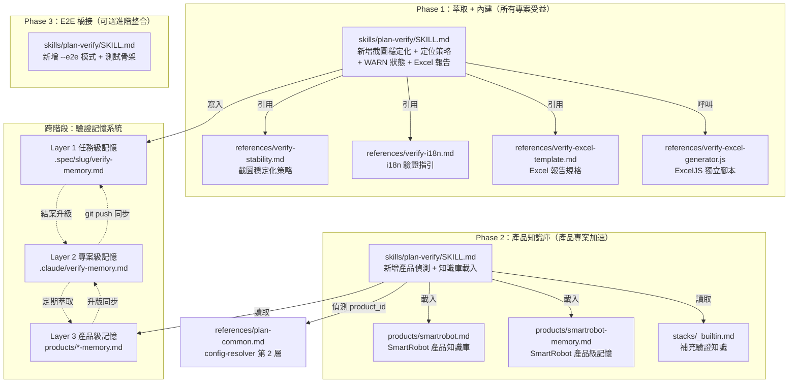
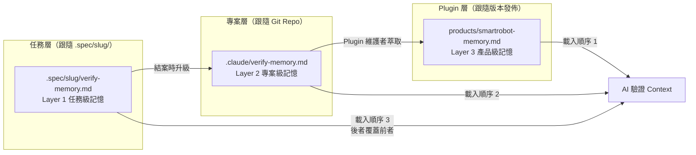
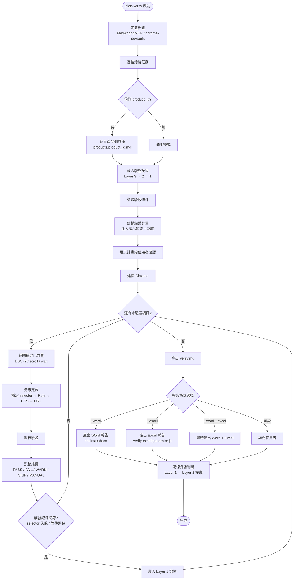

# 架構設計 — plan-verify 進化

## 1. 架構總覽

### 1.1 Phase 分層架構圖



### 1.2 驗證記憶系統三層架構



### 1.3 plan-verify 新流程圖



---

## 2. 檔案清單

### 2.1 新增檔案

| # | 檔案路徑 | Phase | 用途 | 預估行數 |
|---|---------|-------|------|---------|
| N1 | `references/verify-stability.md` | 1 | 截圖穩定化策略 | ~80 |
| N2 | `references/verify-i18n.md` | 1 | i18n 驗證指引 | ~120 |
| N3 | `references/verify-excel-template.md` | 1 | Excel 報告規格定義 | ~150 |
| N4 | `references/verify-excel-generator.js` | 1 | ExcelJS 獨立產出腳本 | ~350 |
| N5 | `products/smartrobot.md` | 2 | SmartRobot 產品知識庫 | ~200 |
| N6 | `products/smartrobot-memory.md` | 2 | SmartRobot 產品級記憶（初始） | ~60 |

### 2.2 修改檔案

| # | 檔案路徑 | Phase | 修改範圍 | 預估變更行數 |
|---|---------|-------|---------|------------|
| M1 | `skills/plan-verify/SKILL.md` | 1+2+3 | 主要修改：新增多個段落與流程步驟 | +250 |
| M2 | `~/.claude-company/feature-workflow/stacks/_builtin.md` | 2 | 補充 spring-boot-jpa 驗證知識 | +30 |
| M3 | `references/plan-common.md` | 2 | 補充 product 偵測邏輯（config-resolver 第 4 層） | +25 |

> **注意**：`stacks/_builtin.md` 的實體位於使用者設定目錄 `~/.claude-company/feature-workflow/stacks/`，不在 plugin 原始碼內。此為設定層級的擴充，不隨 plugin 版本發佈。

> **plan-start/SKILL.md 不修改**：product_id 偵測由 plan-verify 自行從 `projects/{id}.md` 讀取，不需要 plan-start 介入。product_id 欄位在 `projects/{id}.md` 中是選填欄位，由 `/project-add` 負責寫入（Phase 2 的 2.3 擴充）。

---

## 3. 每個檔案的內容規格

### N1: `references/verify-stability.md`

**Phase**: 1
**用途**: 定義截圖前的穩定化 SOP，確保每次截圖一致、可重現。從 SmartRobotE2ETest 的 `global-hooks.js` 萃取。

**主要段落**：

```
# 截圖穩定化策略

## 截圖前置步驟（每次截圖前強制執行）
  1. ESC ×2（關閉 modal / dropdown / tooltip）
  2. 關閉測試面板（若可見）
  3. window.scrollTo(0, 0)
  4. waitForLoadState('networkidle', 3s)
  5. waitForTimeout(1500)（等動畫結束）
  6. fullPage screenshot

## 失敗重試策略
  - 最多 3 次
  - 每次多等 1s
  - 仍失敗則標記「(截圖不可用)」

## MCP 模式實作
  （Playwright MCP 的具體 evaluate_script 指令序列）

## Bash 模式實作
  （$CDP eval 的具體指令序列）
```

**依賴關係**：被 `skills/plan-verify/SKILL.md` 引用（步驟 5 截圖前呼叫）。
**預估行數**：~80 行

---

### N2: `references/verify-i18n.md`

**Phase**: 1
**用途**: 定義多語系驗證策略，包含語系偵測順序與定位策略切換。從 SmartRobotE2ETest 的 `i18n-helper.js` 萃取。

**主要段落**：

```
# i18n 驗證指引

## 支援語系
  - zh-TW（預設）、zh-CN、en-US、ja-JP

## 語系偵測順序
  1. spec.md 明確指定
  2. <html lang="..."> 偵測
  3. 產品知識庫預設語系
  4. 預設 zh-TW

## 產品模式（有 product_id）
  - 載入 i18n 對照表
  - 用翻譯文字做元素定位
  - 截圖反映實際語系，報告永遠繁體中文

## 通用模式（無 product_id）
  - 優先用穩定 selector（語言無關）
  - Snapshot → AI 解讀 a11y tree
  - evaluate DOM 查詢

## 報告語言
  - verify.md 永遠繁體中文
  - 截圖反映測試時的實際語系
```

**依賴關係**：
- 被 `skills/plan-verify/SKILL.md` 引用（步驟 3 建構驗證計畫時參考）
- 搭配 `products/{id}.md` 的 i18n 對照表使用（Phase 2）

**預估行數**：~120 行

---

### N3: `references/verify-excel-template.md`

**Phase**: 1
**用途**: 定義 Excel 驗收報告的完整規格（Sheet 結構、欄位寬度、色彩、格式）。為 `verify-excel-generator.js` 的規格說明文件。

**主要段落**：

```
# Excel 驗收報告規格

## Sheet 1：驗收總表
  ### 標題區
    - 合併儲存格、深藍背景、白字
  ### 資訊區
    - 專案名稱、功能名稱、驗證日期、測試語系、驗測工具
  ### 明細表
    - 欄位定義（#, 驗收條件, 結果, 截圖, 備註, 測試日期）
    - 寬度、對齊、背景色區分
  ### 簽核區
    - 製作人 / 審核人 / 客戶確認
  ### 格式
    - 凍結標題列

## Sheet 2~N：各驗收項目步驟
  ### 標頭
    - 驗收條件名稱、結果
  ### 操作步驟
    - 編號 + 人話敘述（from human_steps）
  ### 預期結果 / 實際結果
  ### 截圖嵌入
    - 讀取 PNG 寬高，縮放到 800px 寬
  ### API 測試紀錄
    - 若有 evidence 區塊
  ### 底部
    - 超連結回驗收總表

## 敏感資訊遮罩
  - 與 Word 報告相同規則

## 色彩定義
  | 狀態 | 背景色 | 文字色 |
  （PASS 綠、FAIL 紅、WARN 橙、SKIP 灰、MANUAL 藍）
```

**依賴關係**：
- 為 `references/verify-excel-generator.js` 的規格依據
- 被 `skills/plan-verify/SKILL.md` 引用（步驟 10 報告產出）

**預估行數**：~150 行

---

### N4: `references/verify-excel-generator.js`

**Phase**: 1
**用途**: 獨立 Node.js 腳本，讀取 verify.md + 截圖 + evidence，產出 `.xlsx` 檔案。使用 `npx --yes exceljs` 自動安裝依賴。

**主要結構**：

```javascript
#!/usr/bin/env node
/**
 * verify-excel-generator.js
 * 從 verify.md 產出 Excel 驗收報告
 *
 * 用法：
 *   node verify-excel-generator.js \
 *     --verify .spec/{slug}/verify.md \
 *     --screenshots .spec/{slug}/screenshots/ \
 *     --evidence .spec/{slug}/evidence/ \
 *     --output .spec/{slug}/verify-report.xlsx \
 *     --cover '{"project":"...","feature":"...","author":"..."}'
 */

// 1. 解析 CLI 參數（--verify, --screenshots, --evidence, --output, --cover）
// 2. parseVerifyMd()  — 解析 verify.md 結構
//    - 摘要區（日期、環境、模式、工具）
//    - 統計區（PASS/FAIL/WARN/SKIP/MANUAL 數量）
//    - 各驗收項目（狀態、human_steps、evidence、截圖路徑）
// 3. createSummarySheet()  — Sheet 1 驗收總表
//    - 標題區（合併儲存格 + 樣式）
//    - 資訊區
//    - 明細表（含結果色彩）
//    - 簽核區
//    - 凍結標題列
// 4. createDetailSheets()  — Sheet 2~N 各驗收項目
//    - 標頭 + 結果
//    - 操作步驟
//    - 預期/實際結果
//    - 截圖嵌入（addImage, 縮放到 800px 寬）
//    - API 測試紀錄（遮罩敏感資訊）
//    - 超連結回 Sheet 1
// 5. maskSensitiveInfo()  — 敏感資訊遮罩
// 6. 寫入 .xlsx
```

**依賴關係**：
- 執行時依賴：`exceljs`（透過 `npx --yes exceljs` 自動安裝）
- 輸入：verify.md、screenshots/、evidence/
- 輸出：verify-report.xlsx
- 被 `skills/plan-verify/SKILL.md` 以 `node` 指令呼叫

**為什麼是 .js 而非 .md**：這是可執行程式碼，負責解析 Markdown 和產生 Excel 二進位檔案。Markdown 只能描述規格，無法實際產出 .xlsx。AI 不會在 runtime 寫程式產 Excel，而是呼叫這個預建腳本。

**預估行數**：~350 行

---

### N5: `products/smartrobot.md`

**Phase**: 2
**用途**: SmartRobot 產品操作知識庫，讓 plan-verify 知道如何導航、定位元素、處理特殊元件。從 SmartRobotE2ETest 的測試程式碼萃取。

**主要段落**：

```markdown
---
name: SmartRobot
stack: spring-boot-jpa
i18n_locales: [zh-TW, zh-CN, en-US, ja-JP]
login_types: [subadmin, admin]
---

## 頁面導航地圖
  | 功能 | URL 路徑 | 登入方式 | 選單路徑 |
  （約 20+ 功能頁面，從 SIDEBAR_GROUPS 萃取）

## 常用 Selector
  | 元素 | Selector | 備註 |
  （全站通用 selector 約 10+ 個）

## i18n 關鍵字對照（高頻操作用）
  | Key | zh-TW | en-US | zh-CN | ja-JP |
  （約 40 個導航 + 操作類關鍵字）

## 特殊操作 Recipe
  ### CKEditor 富文字編輯器
  ### SweetAlert2 確認框
  ### 表單提交（AJAX）

## API 回傳格式（Spring Boot JPA）
  ### 列表查詢（Pageable）
  ### 儲存/更新
  ### 刪除
```

**依賴關係**：
- 被 `skills/plan-verify/SKILL.md` 載入（偵測到 product_id 時）
- 搭配 `references/verify-i18n.md` 使用 i18n 對照表
- 搭配 `products/smartrobot-memory.md` 提供記憶

**預估行數**：~200 行

---

### N6: `products/smartrobot-memory.md`

**Phase**: 2
**用途**: SmartRobot 產品級驗證記憶（Layer 3），存放跨專案通用的驗證經驗。初始版本為空模板，隨使用逐步累積。

**主要段落**：

```markdown
---
product: smartrobot
last_updated: 2026-05-15
---

# SmartRobot 產品級驗證記憶

## 頁面操作記憶
（初始為空，由 Layer 2 升級填入）

## Selector 記憶
| 元素 | 有效 Selector | 無效（別再試） | 備註 |
（初始為空）

## API 回傳格式記憶
（初始引用 smartrobot.md 的 API 格式定義）

## 截圖策略記憶
- 全站 modal 關閉: ESC×2（SweetAlert2 + Bootstrap Modal）

## 踩坑紀錄
| 日期 | 情境 | 問題 | 解法 |
（初始為空）
```

**依賴關係**：
- 被 `skills/plan-verify/SKILL.md` 載入（Layer 3 記憶，最先載入）
- 由專案的 Layer 2 記憶升級而來
- 搭配 `products/smartrobot.md` 使用

**預估行數**：~60 行

---

### M1: `skills/plan-verify/SKILL.md`（修改）

**Phase**: 1 + 2 + 3（分批修改）
**用途**: plan-verify 的主要 Skill 定義，是整個任務的核心修改目標。

**修改內容**：

#### Phase 1 修改

| 插入位置 | 新增內容 | 說明 |
|---------|---------|------|
| 使用方式段落 | 新增 `--excel` 和 `--word --excel` 選項 | Excel 報告支援 |
| 步驟 2 之後（新增 2.5） | 「載入驗證記憶」段落 | Layer 3 → 2 → 1 載入 |
| 步驟 3 之前 | 「截圖穩定化策略」段落 | 引用 `references/verify-stability.md` |
| 步驟 3 之前 | 「元素定位 Fallback 策略」段落 | 4 級 fallback 定義 |
| 步驟 5 每步驟後（新增 5.5） | 「記憶記錄判斷」段落 | 即時記錄觸發條件 |
| 步驟 7 verify.md 格式 | 新增 `⚠️ WARN` 狀態 | 軟斷言支援 |
| 步驟 9 之後（新增 9.5） | 「記憶升級判斷」段落 | Layer 1 → 2 提議 |
| 步驟 10 報告產出 | 新增 Excel 報告選項 | 呼叫 verify-excel-generator.js |
| Gotchas | 新增 Excel 相關注意事項 | ExcelJS、截圖嵌入 |

#### Phase 2 修改

| 插入位置 | 新增內容 | 說明 |
|---------|---------|------|
| 步驟 1 之後（新增 1.5） | 「產品偵測」段落 | 讀取 projects/{id}.md 的 product_id |
| 步驟 2.5 記憶載入 | 擴充 Layer 3 載入 | 從 products/{id}-memory.md 載入 |
| 步驟 3 建構驗證計畫 | 注入產品知識 | 導航地圖、selector、i18n 對照 |
| 步驟 5 逐條驗證 | 產品模式定位策略 | 用 i18n 翻譯文字定位 |

#### Phase 3 修改

| 插入位置 | 新增內容 | 說明 |
|---------|---------|------|
| 使用方式段落 | 新增 `--e2e` 和 `--from-e2e` 選項 | E2E Runner 模式 |
| 步驟 5 之前 | 「E2E 匹配引擎」段落 | verify-map.json 匹配 |
| 步驟 5 | 「混合執行流程」段落 | 有匹配跑 E2E，無匹配退回 MPC |
| 步驟 9 之後 | 「測試骨架產出」段落 | 可選產出 E2E 骨架 |

**依賴關係**：
- 引用：verify-stability.md, verify-i18n.md, verify-excel-template.md
- 呼叫：verify-excel-generator.js
- 載入：products/{id}.md, products/{id}-memory.md
- 讀取：projects/{id}.md（取 product_id）
- 寫入：.spec/{slug}/verify-memory.md（Layer 1）
- 讀寫：.claude/verify-memory.md（Layer 2）

**預估變更行數**：+250 行（原檔 ~820 行，修改後 ~1070 行）

---

### M2: `~/.claude-company/feature-workflow/stacks/_builtin.md`（修改）

**Phase**: 2
**用途**: 為 `spring-boot-jpa` 技術棧補充驗證相關知識，讓 plan-verify 在通用模式下也能利用技術棧的 API 格式規則。

**修改內容**：

在現有的技術棧總表之後，新增 `spring-boot-jpa` 的驗證知識區塊：

```markdown
## spring-boot-jpa 驗證知識

### API 回傳格式

| 操作類型 | 回傳結構 | 驗證要點 |
|---------|---------|---------|
| 列表查詢 | Spring Page（content, totalElements, size, number） | content.length == size, number 遞增 |
| 儲存/更新 | { code, message, data } | code == "0000" |
| 刪除 | { code, message } | code == "0000" |

### Repository 查詢模式

| 模式 | 範例 | 驗證時注意 |
|------|------|---------|
| findBy 方法 | findByStatusAndDate | 參數型別對應 |
| @Query JPQL | 自訂查詢 | 分頁參數 Pageable |
| Specification | 動態查詢 | 多條件組合 |
```

**依賴關係**：
- 被 `references/plan-common.md` 的第 3 層載入邏輯引用
- 被 `skills/plan-verify/SKILL.md` 間接讀取（通用模式下）

**預估變更行數**：+30 行（原檔 ~8 行，修改後 ~38 行）

> **注意**：此檔案位於使用者設定目錄，不在 plugin 原始碼中。修改方式為 plugin 升版時的文件指引，或由 `/plan-setup --migrate` 自動補充。

---

### M3: `references/plan-common.md`（修改）

**Phase**: 2
**用途**: 在「讀取專案上下文」段落中補充產品偵測邏輯，定義 `product_id` 的解析方式。

**修改內容**：

在「第 2 層：專案對應」之後新增「第 4 層：產品知識庫」：

```markdown
### 第 4 層：產品知識庫（需要產品操作知識時）

從 `projects/{id}.md` 的 `product_id` 欄位取得產品 ID：

- 有 product_id → 讀取 plugin 目錄的 `products/{product_id}.md`
- 無 product_id → 通用模式（不載入產品知識庫）

取得：頁面導航地圖、常用 Selector、i18n 對照表、特殊操作 Recipe、API 格式。

### 第 4.1 層：產品級記憶（需要驗證記憶時）

有 product_id 時，額外讀取 `products/{product_id}-memory.md`。

### projects/{id}.md 新增選填欄位

| 欄位 | 必要性 | 說明 |
|------|--------|------|
| product_id | 選填 | 指向 products/{id}.md 的產品知識庫 |
```

**依賴關係**：
- 被 `skills/plan-verify/SKILL.md` 引用（產品偵測流程）
- 參照 `references/config-resolver.md` 的漸進式載入邏輯

**預估變更行數**：+25 行

---

## 4. Phase 分隔與實作順序

### Phase 1：萃取 + 內建（所有專案受益）

**目標**：將 E2E 測試的成熟策略內建到 plugin，零外部依賴，所有專案立即受益。

| 順序 | 檔案 | 類型 | 前置依賴 |
|------|------|------|---------|
| 1-1 | `references/verify-stability.md` (N1) | 新增 | 無 |
| 1-2 | `references/verify-i18n.md` (N2) | 新增 | 無 |
| 1-3 | `references/verify-excel-template.md` (N3) | 新增 | 無 |
| 1-4 | `references/verify-excel-generator.js` (N4) | 新增 | N3（需參照規格） |
| 1-5 | `skills/plan-verify/SKILL.md` (M1-Phase1) | 修改 | N1, N2, N3, N4 |

**可並行**：N1、N2、N3 可同時進行。N4 依賴 N3。M1 的 Phase 1 修改在 N1~N4 完成後執行。

```mermaid
gantt
    title Phase 1 實作順序
    dateFormat X
    axisFormat %s

    section references
    verify-stability.md (N1)     :n1, 0, 1
    verify-i18n.md (N2)          :n2, 0, 1
    verify-excel-template.md (N3):n3, 0, 1
    verify-excel-generator.js (N4):n4, after n3, 1

    section SKILL.md
    Phase 1 修改 (M1)            :m1, after n4, 2
```



### Phase 2：產品知識庫（產品專案加速）

**目標**：為特定產品（SmartRobot）建立操作知識庫，有 product_id 的專案驗證速度顯著提升。

| 順序 | 檔案 | 類型 | 前置依賴 |
|------|------|------|---------|
| 2-1 | `products/smartrobot.md` (N5) | 新增 | 無（但需從 SmartRobotE2ETest 萃取） |
| 2-2 | `products/smartrobot-memory.md` (N6) | 新增 | N5（基於產品定義） |
| 2-3 | `references/plan-common.md` (M3) | 修改 | 無 |
| 2-4 | `stacks/_builtin.md` (M2) | 修改 | 無 |
| 2-5 | `skills/plan-verify/SKILL.md` (M1-Phase2) | 修改 | N5, N6, M3, M2, M1-Phase1 |

**可並行**：N5 和 M3、M2 可同時進行。N6 依賴 N5。M1 的 Phase 2 修改在所有前置完成後執行。

```mermaid
gantt
    title Phase 2 實作順序
    dateFormat X
    axisFormat %s

    section products
    smartrobot.md (N5)           :n5, 0, 2
    smartrobot-memory.md (N6)    :n6, after n5, 1

    section references + stacks
    plan-common.md (M3)          :m3, 0, 1
    _builtin.md (M2)             :m2, 0, 1

    section SKILL.md
    Phase 2 修改 (M1)            :m1p2, after n6, 2
```



### Phase 3：E2E 橋接（可選進階整合）

**目標**：為已有 E2E 測試 repo 的團隊提供 Runner 模式和測試骨架產出，為「錦上添花」功能。

| 順序 | 檔案 | 類型 | 前置依賴 |
|------|------|------|---------|
| 3-1 | `skills/plan-verify/SKILL.md` (M1-Phase3) | 修改 | M1-Phase2 完成 |

Phase 3 只修改 SKILL.md，新增 `--e2e`、`--from-e2e` 模式和測試骨架產出邏輯。不新增額外檔案（verify-map.json 由外部 E2E repo 維護）。

### 跨階段：驗證記憶系統

記憶系統的實作分散在各 Phase 中：

| 記憶功能 | 實作 Phase | 實作位置 |
|---------|-----------|---------|
| Layer 1 寫入（任務級） | Phase 1 | SKILL.md 步驟 5.5、9.5 |
| Layer 2 升級（專案級） | Phase 1 | SKILL.md 步驟 9.5 |
| Layer 3 載入（產品級） | Phase 2 | SKILL.md 步驟 2.5 + N6 |
| Layer 3 格式定義 | Phase 2 | N6 (smartrobot-memory.md) |
| 三層合併載入 | Phase 1 | SKILL.md 步驟 2.5 |

---

## 5. 設計決策記錄

### DR-1：為什麼用獨立 references/ 而非全部塞進 SKILL.md

**問題**：截圖穩定化策略（~80 行）、i18n 指引（~120 行）、Excel 規格（~150 行）要放哪裡？

**決策**：各自獨立為 `references/` 下的檔案，SKILL.md 以引用方式指向。

**理由**：
1. **SKILL.md 已經 ~820 行**：再塞 350 行會達到 1170 行，超過可維護上限。Claude Code 的 context window 對超長 SKILL.md 的處理效率會下降。
2. **關注點分離**：截圖穩定化是 **how**（怎麼做），SKILL.md 定義的是 **what**（做什麼）和 **when**（什麼時候做）。分離後各檔案職責清晰。
3. **可複用性**：`verify-stability.md` 未來可能被其他 Skill（如 plan-browse、qa）引用，放在 references/ 是共用資源。
4. **漸進式載入**：AI 只有在實際需要截圖時才載入 stability reference，減少不必要的 context 消耗。

**替代方案**：
- 全部塞進 SKILL.md：會造成檔案過長、混淆 AI 的焦點。
- 放在 skills/plan-verify/ 目錄下：違反 plugin 慣例（skill 目錄只放 SKILL.md）。

---

### DR-2：verify-excel-generator.js 為什麼是 Node.js 腳本而非 Markdown

**問題**：Excel 報告的產出方式如何設計？

**決策**：在 `references/` 中放一個獨立的 Node.js 腳本 `verify-excel-generator.js`。

**理由**：
1. **Excel 是二進位格式**：不像 Word 可以透過 `/minimax-docx` Skill 從 Markdown 轉換。ExcelJS 需要程式化操作（合併儲存格、設定寬度、嵌入圖片、設定色彩），這些無法用 Markdown 描述。
2. **確定性 > AI 即興**：每次產出的 Excel 格式必須一致（欄寬、色彩、凍結列位置）。讓 AI 每次用 ExcelJS 即興寫程式會導致格式不一致，預建腳本確保確定性。
3. **零依賴安裝**：使用 `npx --yes exceljs` 自動安裝，不污染專案 node_modules，用完即棄。
4. **可測試**：獨立腳本可以在開發階段單獨測試（給一個 mock verify.md），不需要跑整個 plan-verify 流程。

**替代方案**：
- 讓 AI 在 runtime 用 ExcelJS 寫程式：格式不一致、每次消耗大量 token。
- 用 Python + openpyxl：Node.js 生態更適合（npx 免安裝），且團隊更熟悉 JS。
- 放在 scripts/ 目錄：scripts/ 目前放的是 plugin 內部工具腳本，verify-excel-generator.js 更偏向「reference 級的可執行規格」，放 references/ 更符合語意（template + generator 成對）。

---

### DR-3：產品知識庫為什麼放 products/ 而非 stacks/

**問題**：SmartRobot 的產品操作知識（導航地圖、selector、i18n 對照）要放哪裡？

**決策**：在 plugin 根目錄新增 `products/` 目錄，與 `stacks/`、`references/`、`skills/` 同級。

**理由**：
1. **語意不同**：`stacks/` 定義**技術棧**（Spring Boot + JPA + MySQL），描述的是框架和工具。`products/` 定義**產品操作知識**（SmartRobot 的頁面在哪裡、selector 是什麼），描述的是業務系統。同一個技術棧可以有多個產品（SmartRobot、WiSe 都用 spring-boot-jpa）。
2. **一對多關係**：一個 stack 對應多個 product，product 是 stack 的下層概念。如果放在 stacks/ 會混淆層級。
3. **成長空間**：未來可能有 `products/wise.md`、`products/linebc.md` 等，需要獨立目錄管理。
4. **Plugin vs 設定**：`stacks/_builtin.md` 的實體在使用者設定目錄（`~/.claude-company/feature-workflow/stacks/`），但 `products/` 是 plugin 內建知識，應隨 plugin 版本發佈。

**替代方案**：
- 放在 `stacks/` 下：語意衝突，stack 是技術棧不是產品。
- 放在 `references/`：references/ 存放的是通用策略和模板，不適合放特定產品知識。
- 放在使用者設定目錄：產品知識是團隊共享的，應隨 plugin 版本同步，放 plugin 原始碼更合適。

---

### DR-4：驗證記憶的三層分離理由

**問題**：驗證過程中累積的經驗（有效 selector、等待策略、踩坑紀錄）要存在哪裡？

**決策**：三層記憶架構，各有不同的共享範圍和生命週期。

**理由**：

| 層級 | 為什麼需要獨立 | 不分離的問題 |
|------|---------------|------------|
| Layer 1（任務級） | 每次驗證可能產生大量嘗試記錄，其中很多是一次性的（測試資料相關、bug workaround）。若全部升級到專案級，會污染記憶庫。 | 記憶庫膨脹，噪訊過多 |
| Layer 2（專案級） | 同一個專案不同功能的驗證經驗可以共享（如「搜尋框 selector 全站通用」），但不同專案的經驗不應混在一起。透過 git 追蹤，push 後同事可用。 | 同事重複踩坑 |
| Layer 3（產品級） | 跨專案通用的產品知識（如 SmartRobot 的 CKEditor 操作方式），由 plugin 維護者定期從各專案的 Layer 2 萃取，升版後所有人自動獲得。 | 每個專案各自發現相同問題 |

**載入順序的合理性**：Layer 3（最通用）→ Layer 2（專案特化）→ Layer 1（任務特化）。後者覆蓋前者，確保最具體的經驗優先。這與 CSS 的特異性（specificity）概念一致。

**升級方向的合理性**：Layer 1 → Layer 2 → Layer 3。經驗從具體到通用逐步匯聚，每一步都有人工/AI 判斷確認，避免噪訊向上傳播。

**替代方案**：
- 單層記憶（只有 Layer 2）：無法區分一次性經驗和通用經驗，記憶庫快速膨脹。
- 兩層（任務級 + 產品級）：缺少專案級共享，同事之間無法透過 git 共享驗證經驗。
- 全部放 Notion：增加網路依賴，離線無法使用，且 Notion 不適合存放高頻讀寫的小片段知識。

---

## 6. 檔案依賴關係矩陣

```
                   被引用方 →
引用方 ↓          N1   N2   N3   N4   N5   N6   M1   M2   M3
─────────────────────────────────────────────────────────
N1 stability       -    -    -    -    -    -    ★    -    -
N2 i18n            -    -    -    -    ○    -    ★    -    -
N3 excel-tmpl      -    -    -    ★    -    -    ★    -    -
N4 excel-gen       -    -    ←    -    -    -    ★    -    -
N5 smartrobot      -    -    -    -    -    ★    ★    -    -
N6 sr-memory       -    -    -    -    ←    -    ★    -    -
M1 SKILL.md        ←    ←    ←    ←    ←    ←    -    ←    ←
M2 _builtin        -    -    -    -    -    -    ←    -    -
M3 plan-common     -    -    -    -    -    -    ←    -    -

圖例：★ = 被引用   ← = 引用   ○ = 搭配使用（非直接引用）
```

M1（SKILL.md）是所有檔案的匯聚點，引用或載入其他所有檔案。其他檔案之間的依賴關係相對簡單（N4 依賴 N3 規格、N6 依賴 N5 定義、N2 搭配 N5 的 i18n 表使用）。
