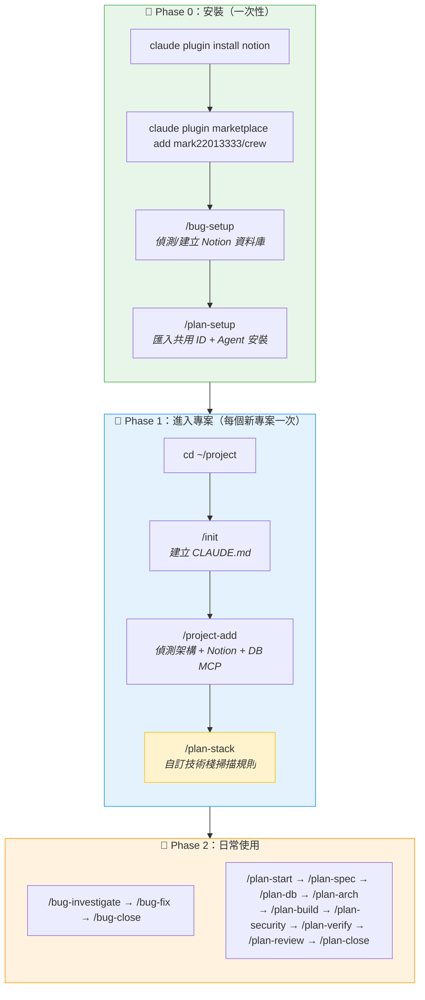
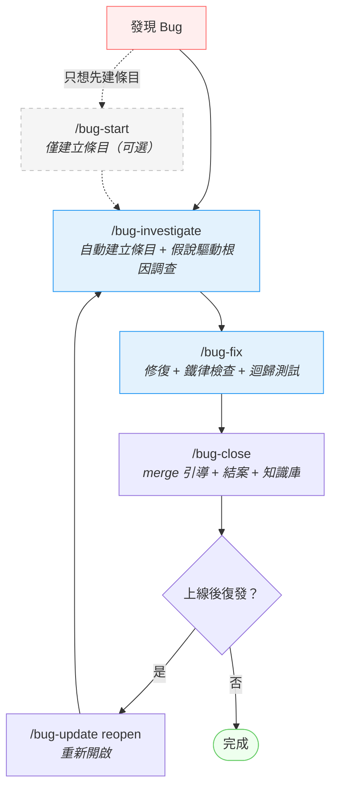
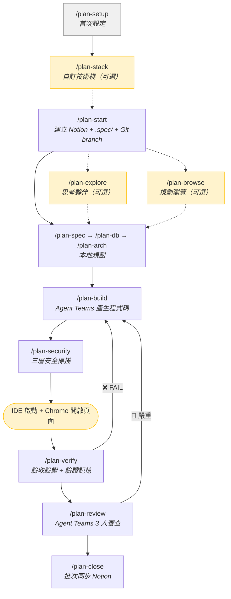
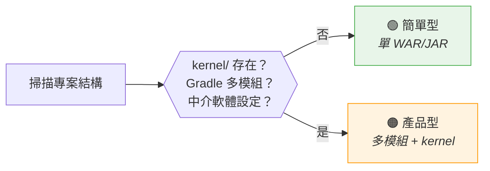

# CREW — Claude Code Plugins

整合 Notion 與 Claude Code 的自訂 Plugin 集合，涵蓋 Bug 處理與功能開發的完整工作流。

## 快速安裝

```bash
# 安裝 Notion MCP Server（提供 Notion 讀寫能力）
claude plugin install notion

# 加入 Marketplace → 安裝（安裝後自動啟用）
claude plugin marketplace add mark22013333/crew && \
claude plugin install bug-workflow && \
claude plugin install feature-workflow
```

安裝後 Plugin 會自動啟用，**重啟 Claude Code** 後在專案目錄下執行 `/bug-setup` 和 `/plan-setup` 進行初始化。

> 可用 `claude plugin list` 確認狀態，確保 Plugin 顯示為 `✔ enabled`。
> 若未自動啟用：`claude plugin enable bug-workflow && claude plugin enable feature-workflow`

---

## 進階文件

| 主題 | 連結 |
|------|------|
| 完整前置條件與系統需求 | [docs/prerequisites.md](docs/prerequisites.md) |
| Windows 使用者指南 | [docs/windows.md](docs/windows.md) |
| DB MCP（DBHub）設定 | [docs/dbhub.md](docs/dbhub.md) |
| Notion 資料庫架構 ER 圖 | [docs/notion-schema.md](docs/notion-schema.md) |
| 架構決策紀錄（ADR） | [docs/adr/](docs/adr/) |
| 開發與發版指南 | [CONTRIBUTING.md](CONTRIBUTING.md) |

> 💡 環境有問題？跑 `/crew-doctor` 一次性檢查所有依賴並給出修法。

---

## 完整工作流

從安裝到日常使用的完整流程：



> `/plan-stack` 為可選步驟 — 若 `/project-add` 偵測到的技術棧屬於內建（如 `spring-boot-jpa`），可跳過。若專案使用非標準分層結構或內建定義不夠精確，建議執行。

---

## Plugin 一覽

### Bug Workflow

自動化 Bug 生命週期管理 — 建立、調查、結案、搜尋、復發處理。



| 指令 | 說明 |
|------|------|
| `/bug-setup` | 首次設定引導 |
| `/bug-investigate` | **主入口** — 自動建立條目 + 假說驅動根因調查（五階段 + 3-Strike + 釐清問題） |
| `/bug-fix` | 修復紀律（分支檢查 + 鐵律 + 迴歸測試 + merge 引導） |
| `/bug-close` | merge 引導 + 結案 + 同步知識庫 |
| `/bug-start <問題簡述>` | 僅建立條目（可選，investigate 會自動處理） |
| `/bug-update <內容>` | 更新調查資訊（Log、SQL、判斷） |
| `/bug-update reopen <Bug>` | 重新開啟已結案 Bug |
| `/project-add` | **偵測專案架構** + Notion 註冊 + DB MCP 安裝 |
| `/crew-doctor` | 環境健診（檢查 18 項依賴與設定） |
| `/crew-upgrade` | 一次更新所有 CREW plugins |

詳細說明見 [plugins/bug-workflow/README.md](plugins/bug-workflow/README.md)

### Feature Workflow

功能開發全生命週期管理 — 本地規劃、Agent Teams 產生程式碼與審查、瀏覽器驗收驗證、結案同步 Notion。

含 4 個 Opus Agent，在規格、DB、架構、程式碼產生階段提供專家級輸出。



| 指令 | 說明 | Notion 呼叫 |
|------|------|-------------|
| `/plan-setup` | 首次設定引導（Notion 偵測 + Agent 安裝） | 一次性 |
| `/plan-stack` | 偵測專案分層結構，建立自訂技術棧 | **0 次** |
| `/plan-start <任務簡述>` | 建立 Notion 條目 + `.spec/` 目錄 + Git branch（含退出驗證） | **3-5 次** |
| `/plan-explore [主題]` | 思考夥伴：探索想法、調查問題、比較方案 | **0 次** |
| `/plan-browse [slug]` | 規劃瀏覽：深度閱讀、跨任務比較、模式搜尋 | **0 次** |
| `/plan` | 完整規劃串接（自動依序 spec→db→arch） | **0 次** |
| `/plan-spec` | 技術規格書 | **0 次** |
| `/plan-db` | 資料庫設計 | **0 次** |
| `/plan-arch` | 架構設計 | **0 次** |
| `/plan-build [--dry-run]` | Agent Teams 最多 5 人產生程式碼（含 DB Engineer） | **0 次** |
| `/plan-security` | 三層安全掃描 | **0 次** |
| `/plan-verify [--excel/--e2e]` | 瀏覽器驗收驗證 + 驗證記憶 + Word 多風格報告（3 種風格可選）+ Excel 報告 + E2E Runner（含截圖穩定化、i18n 4 語系） | **0 次** |
| `/plan-review [--quick]` | Agent Teams 3 人審查（邏輯/品質/效能） | **0 次** |
| `/plan-close` | 一次性批次同步到 Notion + 知識庫 + Git 提交 | **3-5 次** |
| `/plan-sync` | 手動中途同步（按需） | **2-3 次** |
| `/plan-status` | 列出所有活躍任務 | **0 次** |

詳細說明見 [plugins/feature-workflow/README.md](plugins/feature-workflow/README.md)

---

## 專案註冊（/project-add）

`/project-add` 是進入新專案的關鍵步驟，自動偵測專案架構並同步到 Notion。

### 專案類型自動偵測



| 專案類型 | 判斷條件 | 範例 |
|---------|---------|------|
| **簡單型** | 單模組 Maven/Gradle、無外部資源目錄 | LineBC、PushAPIService |
| **產品型** | 多模組 Gradle、`kernel/` 目錄、Solr/Hazelcast 等中介軟體 | SmartRobot、SmartCore |

### 自動偵測項目

| 偵測項目 | 來源 |
|---------|------|
| Git Repo 識別碼 | `git remote get-url origin` |
| 建置工具 | `pom.xml` / `build.gradle` |
| 技術棧 | Spring 版本 + ORM 框架 |
| DB 類型 | JDBC URL / `-Dsql=` / driver 依賴 |
| 專案類型 | 目錄結構 + 中介軟體偵測 |
| 中介軟體（產品型） | Solr、Hazelcast 等設定檔 |

### Notion 頁面模版

`/project-add` 會根據專案類型套用對應的 Notion 頁面模版：

**簡單型**：📋 概要 → 🏗️ 結構 → 🔧 建置 → 🗄️ DB → 🖥️ 主機 → 🚀 部署 → ⚠️ 注意 → 📚 參考

**產品型**（額外包含）：
- 📦 中介軟體區段（Solr、Hazelcast 等）
- VM Options 範本（使用 `{PROJECT_ROOT}` 相對路徑）
- H2 Quartz 排程 DB 資訊
- `kernel/` 目錄結構說明

---

## 前置檢查機制

所有 CREW Skill（除 setup 本身外）執行前會自動檢查：

| 檢查項目 | 未通過時 | 適用 Skill |
|---------|---------|-----------|
| **Node.js + Git 已安裝？** | 顯示 OS 對應安裝指令 | bug-setup、plan-setup（初始化時） |
| **CLAUDE.md 存在？** | 提示執行 `/init` | bug-start/update/close、plan-start/build/verify/review/close |
| **設定檔存在？** | 提示執行 `/bug-setup` 或 `/plan-setup` | 所有 Skill |
| **專案已註冊？** | 提示執行 `/project-add` | bug-start/update/close、plan-start/close/sync |

> 💡 `/init` 建立的 CLAUDE.md 建議 **commit + push**，讓團隊成員進入專案時不需重新執行。
> 進階：跑 `/crew-doctor` 額外檢查 MCP、Agent Teams、Notion 可達性等 18 項。

---

## 首次設定

### Step 1：安裝 Notion MCP Server（擇一）

**方式 A：Notion Plugin（推薦）**

```bash
claude plugin install notion
```

安裝後**重啟 Claude Code**，首次使用 Notion 工具時會自動開啟瀏覽器進行 OAuth 授權：

1. 瀏覽器彈出 Notion 授權頁面
2. 選擇要授權的 Workspace
3. 點擊「允許存取」
4. 授權完成後回到 Claude Code

> 每位使用者需各自完成 OAuth 授權，授權範圍僅限自己選擇的 Workspace。

**方式 B：notion-local（API Token，適合 CI/CD 或 Plugin 無法使用時）**

```bash
claude mcp add notion-local --scope user -- \
  npx @anthropic-ai/notion-mcp-server
```

需額外設定：
1. 到 [notion.so/my-integrations](https://www.notion.so/my-integrations) 建立 Integration
2. 在 `~/.claude/settings.json` 設定 `"env": { "NOTION_TOKEN": "ntn_xxx" }`
3. 在 Notion 中將 Integration 加入要存取的頁面（頁面右上角 `···` → Connections）

> 限制：notion-local 無法自動建立資料庫 View（setup 時會提示手動建立，不影響日常使用）。
> CREW 會自動偵測已安裝的 Notion 後端，優先使用 Notion Plugin。

### Step 2：安裝 Workflow Plugin

```bash
claude plugin marketplace add mark22013333/crew && \
claude plugin install bug-workflow && \
claude plugin install feature-workflow
```

安裝後 Plugin 會自動啟用。**重啟 Claude Code** 使 Plugin 生效。

> 可用 `claude plugin list` 確認 Plugin 狀態是否為 `✔ enabled`。若未自動啟用，手動執行：
> ```bash
> claude plugin enable bug-workflow && claude plugin enable feature-workflow
> ```

### Step 3：全域設定

```bash
/bug-setup        # 偵測/建立 Notion 資料庫、產出設定檔
/plan-setup       # 自動匯入 bug-workflow 共用 ID + 設定技術棧
```

建議先執行 `/bug-setup`，`/plan-setup` 會自動匯入共用的 Notion ID 和專案路徑。

> Setup 會自動偵測 Workspace 中的資料庫並列出候選讓你選擇，不需要手動輸入任何 ID。
> 找不到資料庫時，Setup 會引導從零建立（含標準欄位 + Views + Relation）。

### Step 4：進入專案

```bash
cd ~/IdeaProjects/YourProject   # 切換到專案目錄
/init                           # 建立 CLAUDE.md（Claude Code 內建指令）
/project-add                    # 偵測架構 → Notion 註冊 → 可選安裝 DB MCP
/plan-stack                     # （可選）自訂技術棧掃描規則
```

> ⚠️ `/init` 後建議 `git add CLAUDE.md && git commit && git push`，讓團隊共用。
> `/project-add` 會在結束時自動提醒。

**何時需要 `/plan-stack`？**

| 情境 | 是否需要 |
|------|---------|
| 技術棧是內建四種之一，分層結構標準 | ❌ 可跳過 |
| 內建技術棧但有額外分層（如 DB Service、UI Service） | ✅ 建議執行 |
| 完全自訂的技術棧（非 Spring 系列等） | ✅ 必須執行 |

`/plan-stack` 會掃描專案的 `src/main/java` 目錄，自動辨識各層級的 package 命名慣例，產生掃描規則寫入 `stacks/{id}.md`。`/plan-build` 的 Agent 會讀取這些規則找到現有程式碼學習風格。

### 更新 Plugin

```bash
/crew-upgrade              # 一次更新所有 CREW plugins + 顯示 CHANGELOG
```

或手動更新：

```bash
claude plugin update bug-workflow@company-marketplace && \
claude plugin update feature-workflow@company-marketplace
```

更新完成後**重啟 Claude Code** 使新版生效。

> 若 `update` 顯示已是最新但功能未生效，可先移除再重裝：
> ```bash
> claude plugin uninstall feature-workflow@company-marketplace && \
> claude plugin install feature-workflow@company-marketplace
> ```

---

## 跨專案支援

Plugin 透過 `git remote get-url origin` 自動偵測 Git Repo 識別碼（如 `FUB03P2402/PushAPIService`），比對設定檔中的「Git Repo」欄位，自動關聯到正確的 Notion 專案。

在不同專案目錄下執行指令，會自動對應不同的 Notion 專案，無需手動切換。

## 設定檔

| 設定 | 路徑 | 格式 | 說明 |
|------|------|------|------|
| Bug Workflow | `~/.claude-company/bug-workflow-config.md` | 單一檔案 | Notion ID、專案對應、欄位對照 |
| Feature Workflow | `~/.claude-company/feature-workflow/` | 階層式目錄 | config.md + stacks/ + projects/ |
| DB MCP | `.claude/settings.local.json`（專案級） | JSON | DBHub 連線資訊（含密碼，勿提交 Git） |

Feature Workflow 採階層式目錄結構，技術棧和專案各自獨立檔案，避免單一設定檔膨脹。詳見 `plugins/feature-workflow/references/config-resolver.md`。

設定儲存位置可在 setup 時選擇公司環境（`~/.claude-company/`）或個人環境（`~/.claude/`）。

## 授權

MIT License
