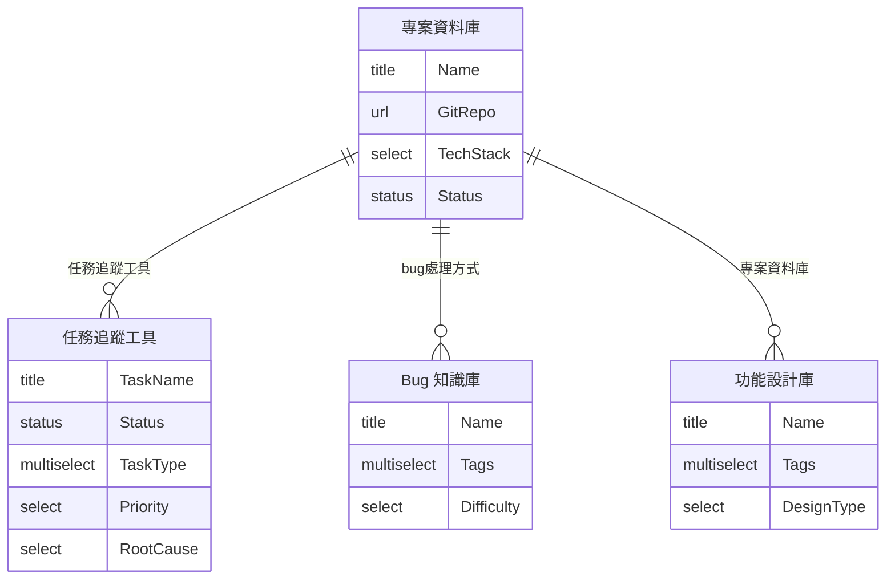

# Notion 資料庫架構

`/bug-setup` 可從零建立所有資料庫（含 Views + Relation），
解決首次使用者沒有資料庫的問題。

---

## ER 圖

---

## 建立順序（解決 Relation 循環依賴）

1. **第一輪**：建立 4 個資料庫（不含 Relation）
2. **第二輪**：補上跨庫 Relation（含雙向 DUAL）

詳細 Schema 見 [plugins/bug-workflow/references/db-templates.md](../plugins/bug-workflow/references/db-templates.md)
（feature-workflow 內含同步副本，CI 自動防漂移）。
