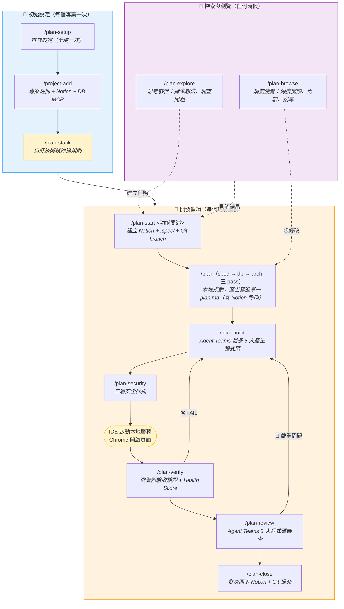
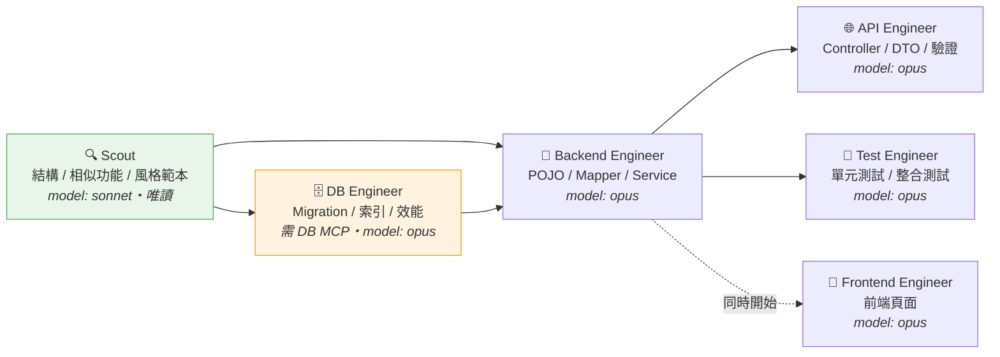
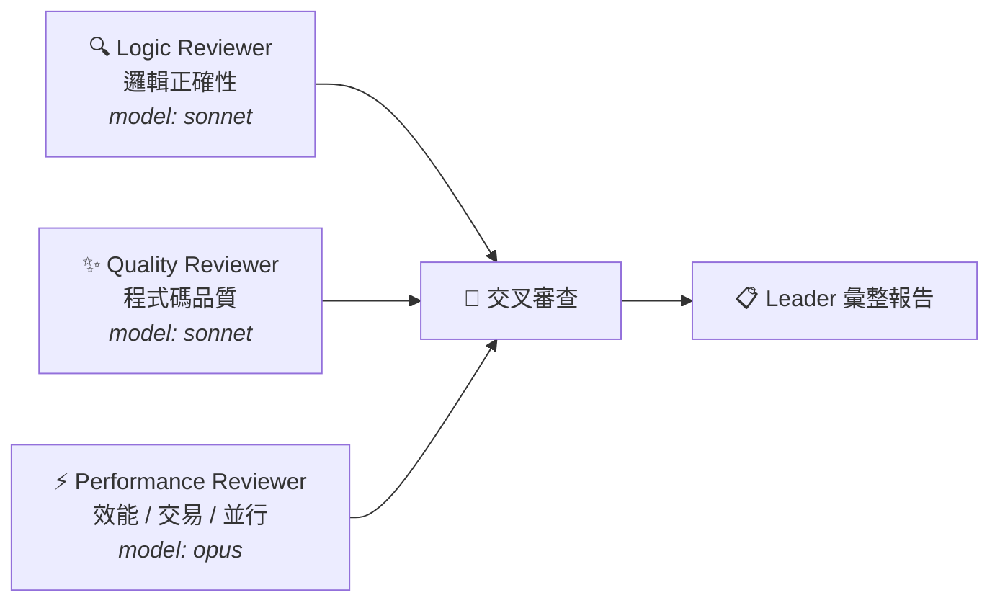

# Feature Workflow Plugin `v5.0.1`

功能開發工作流 — 整合 Notion 與 Claude Code，以 `.spec/` 目錄做本地規劃，Agent Teams 產生程式碼與審查，瀏覽器驗收驗證，結案時批次同步 Notion。

不綁定特定專案架構，所有 Skill 執行時讀取當前專案的 CLAUDE.md 動態適配。

## 安裝

```bash
claude plugin marketplace add mark22013333/crew && \
claude plugin install feature-workflow
```

安裝後 Plugin 會自動啟用。若未自動啟用，手動執行：`claude plugin enable feature-workflow`

首次使用前執行 `/plan-setup` 完成設定引導。

### SessionStart hook（自動執行揭露）

本 plugin 安裝一個 **SessionStart hook**。每次開啟 session（新開、`--resume`、`/clear`）時，
Claude Code 會在**你的本機**執行 `python3 scripts/crew-state.py session-brief`：

- **讀取範圍**：只讀**當前專案**目錄下的 `.spec/*/state.json`（CREW 自己產生的流程狀態檔）
- **不外送任何資料**：純本機 Python 標準函式庫，零網路呼叫
- **不寫專案檔案**：只在系統暫存目錄寫一個 session marker，避免與 bug-workflow 的同名 hook 重複輸出
- **輸出**：未結案任務清單（最多 3 行）＋ 對應的 `/plan-next {slug}` 指令
- **無 `.spec/` 或全部結案時零輸出**（exit 0，不佔 token）
- **不阻擋**：任何錯誤都靜默 exit 0，內建 1 秒總體時限（讀 stdin 上限 0.2 秒），實測典型耗時約 80ms

要關掉：`claude plugin disable feature-workflow`（連 Skill 一起關），或刪除已安裝目錄下的
`hooks/hooks.json` 後重啟 Claude Code（只關 hook、保留 Skill）。hook 變更需**重啟**才生效。

完整說明見[根 README 的 SessionStart hook 段](../../README.md#sessionstart-hook自動執行揭露)。

### 更新

```bash
claude plugin update feature-workflow@company-marketplace
```

更新完成後**重啟 Claude Code** 使新版生效。

---

## 流程



> `/plan-stack` 為可選步驟 — 內建技術棧且分層結構標準時可跳過。
> 開發循環非強制線性，可跳過任何步驟、反覆執行。

---

## `.spec/` 產出結構

一個任務三個檔，跑完整個流程也不會變多：

```
.spec/{slug}/
├── plan.md      唯一給人與 LLM 讀的文件（六章節，典型 50–80 行，硬上限 100）
├── state.json   流程狀態，機器讀的，唯一寫者是 scripts/crew-state.py
├── deploy.sql   唯一 SQL 事實來源（由 /plan 的 db pass 產出）
└── .cache/      一次性報告暫存（gitignore，verify.md 等）
    screenshots/ evidence/   驗收證據（gitignore，binary 不進 context）
```

### plan.md 的六個章節

```markdown
---
slug: login-lock
name: 登入鎖定
type: feature
verified_at_commit: 3f2a91c      # 由 /plan-drift 或 /plan-close 蓋章
verified_at: 2026-07-28
drift_policy: normal              # strict | normal | off
---

## 目標與範圍        <!-- crew:goal owner=spec -->
## 驗收條件          <!-- crew:ac   owner=spec -->
## 決策紀錄          <!-- crew:dec  append-only -->
## 已知取捨與風險    <!-- crew:risk append-only -->
## 指路              <!-- crew:map  append-only -->
## 檢查報告摘要      <!-- crew:rep  append-only -->
```

| 章節 | 可以寫 | **禁止寫** | 上限 |
|------|--------|-----------|------|
| 目標與範圍 | 為何做、In/Out of Scope | API 表、欄位、類別名 | 12 行 |
| 驗收條件 | `- [ ] AC-1 {可機器驗證的一句話}` | 實作步驟、selector | 15 行 |
| 決策紀錄 | `D-n [階段] 決策｜理由｜被否決方案＋否決理由` | DDL、方法簽章、Mermaid | 30 行 |
| 已知取捨與風險 | 明知的技術債、邊界外情境 | 已修掉的問題 | 8 行 |
| 指路 | 錨點（見下） | 把指到的內容抄一份 | 10 行 |
| 檢查報告摘要 | `[日期] {類型} {結論}｜🔴n 🟡n` | 逐條發現 | 6 行 |

禁止欄的共同點是 **code-truth** —— 程式碼才是事實的東西。抄進來只會得到一份改天變謊話的抄本。

### 錨點語法

```markdown
- 鎖定計數改走 Redis（原因：多節點 in-memory 會漏算）
  → `@code:src/main/java/.../LoginAttemptService.java#recordFailure` (L88)
- 表結構見 `@sql:deploy.sql#login_attempt`
```

`@code:<相對路徑>[#<符號>]`、`@sql:deploy.sql#<表名>`。
行號 `(L88)` 在 token **外面** —— 給人看的，程式碼上下位移不算漂移。

### 寫入紀律（四層防覆蓋）

骨架由 `/plan-start` 用 Write 建立**一次**，之後**一律用 Edit 對 HTML 錨點註解插入**：

1. **一節一 owner** —— 只有「目標與範圍／驗收條件」可被改寫，且只有 spec pass 能碰
2. **共享節 append-only，以條目為單位** —— db／arch／build 各 pass 只能插入新 `D-n`
3. **改變主意用 supersede** —— `D-7 [arch] 取代 D-3：…（原因…）`，不刪除舊條目
4. **每條自帶 `[階段]` tag** —— 一眼看出是哪個階段寫的

> 🔴 整檔改寫或把整個章節當 `old_string` 取代，會**靜默吃掉**同一節裡其他階段寫的條目。
> 決策史是這份文件唯一不會過期的價值，弄丟了沒有任何 lint 抓得到。

### 三道漂移防線

| 時機 | 機制 | 會不會擋 |
|------|------|---------|
| 隨時 | `/plan-drift` — 機械型自動修，語意型逐條問過才改 | 否 |
| `plan-build` 退出驗證 | E5/E6 錨點有效性 | 否（剛產完碼符號正在流動，誤殺率最高） |
| `plan-review` | R0 pre-check，報告當 Reviewer 1 的輸入 | 否 |
| **`plan-close`** | **唯一硬關卡**，在 `git add -f` 與 Notion 同步**之前** | **FAIL 擋、WARN 逐筆明示放行** |

`verified_at_commit` 只有 `/plan-drift` 與 `/plan-close` 能寫 ——
`plan-build` 剛改完程式碼就自己蓋章等於作廢。

> 設計理由見 [ADR-006](../../docs/adr/006-anchors-over-transcription.md)；
> v1 舊任務的相容與遷移見 [`references/legacy-v1.md`](references/legacy-v1.md)。

---

## Skill 清單

| Skill | 說明 | Notion 呼叫 |
|-------|------|-------------|
| `/plan-setup` | 首次設定引導（Notion 偵測 + Agent 安裝） | 一次性 |
| `/plan-stack` | 偵測專案分層結構，建立自訂技術棧 | **0 次** |
| `/plan-explore` | 思考夥伴：探索想法、調查問題、比較方案 | **0 次** |
| `/plan-browse` | 規劃瀏覽：深度閱讀、跨任務比較、模式搜尋 | **0 次** |
| `/plan-start` | 建立任務到 .spec/ + Notion（含退出驗證） | **3-5 次** |
| `/plan [spec\|db\|arch]` | 規劃三 pass（不帶參數＝全跑），產出寫進單一 `plan.md` | **0 次** |
| `/plan-build` | 探索官（Sonnet）+ Agent Teams 最多 5 人產生程式碼（Opus，含 DB Engineer） | **0 次** |
| `/plan-security` | 三層安全掃描（靜態規則/上下文感知/對抗性思維） | **0 次** |
| `/plan-verify` | 瀏覽器驗收驗證 + Health Score + 驗證記憶（--excel Excel / --word Word 多風格報告 / --e2e E2E Runner） | **0 次** |
| `/plan-review` | Agent Teams 3 人審查（邏輯 Sonnet／品質 Sonnet／效能 Opus） | **0 次** |
| `/plan-close` | 批次同步 Notion + Git 提交 | **3-5 次** |
| `/plan-sync` | 手動中途同步 .spec/ 到 Notion | **2-3 次** |
| `/plan-deploy-confirm` | SQL 執行回報 — DBA 逐 Step 確認 deploy.sql 執行狀態並寫回 Notion「🚀 部署狀態」 | **3-5 次** |
| `/plan-status` | 查看任務狀態 | **0 次** |
| `/plan-next` | 智慧推薦當前任務的下一步指令（含 `--all` 列所有任務） | **0 次** |
| `/plan-drift` | 文件漂移檢查與修復 — 驗證 `plan.md` 錨點是否失效，機械型自動修、語意型逐條確認 | **0 次** |
| `/plan-demo` | 純本地評估模式 — 不依賴 Notion 產出範例 .spec/demo-{slug}/，給評估者 5 分鐘看到效果 | **0 次** |
| `/project-add` | 新增或更新專案對應（來自 bug-workflow） | 1-2 次 |

---

## 探索與瀏覽

在正式進入開發循環之前（或任何時候），可使用探索和瀏覽功能：

### plan-explore（思考夥伴）

自由形式的思考工具 — 探索問題空間、調查代碼庫、比較方案、視覺化架構。不產出程式碼，但可更新 `.spec/` 設計文件。

```bash
/plan-explore                     # 自由探索
/plan-explore 推播效能優化          # 帶主題探索
/plan-explore <slug>              # 基於已有任務探索
```

### plan-browse（規劃瀏覽器）

深度瀏覽 `.spec/` 目錄中的設計文件。不只列出任務，而是讀取、理解、比較設計內容。

```bash
/plan-browse                         # 互動式瀏覽
/plan-browse <slug>                  # 深度閱讀
/plan-browse --compare <s1> <s2>     # 比較兩個規劃
/plan-browse --search <關鍵字>        # 跨任務搜尋
/plan-browse --patterns              # 分析共通模式
/plan-browse --timeline              # 時間軸瀏覽
```

---

## 前置條件

1. **Node.js ≥ 18** — 所有 MCP Server 的執行環境
   - macOS：`brew install node` 或 [nodejs.org](https://nodejs.org/)
   - Windows：[nodejs.org](https://nodejs.org/) 下載 LTS 版（安裝時勾選 Add to PATH）
   - Linux：`sudo apt install nodejs npm`
2. **Notion Plugin** — `claude plugin install notion`
3. **Agent Teams 環境變數** — plan-build 和 plan-review 必須（見下方設定）

> **Windows 使用者**：詳細的 Windows 環境設定指南請見[根目錄 README](../../README.md#windows-使用者指南)。`/plan-setup` 會自動偵測作業系統並顯示對應的安裝指令。

---

## 前置設定

### plan-build 使用方式

```bash
/plan-build                # 完整產生（後端 + 前端 + API + 測試）
/plan-build --dry-run      # 預覽不建立檔案
/plan-build --backend-only # 只產後端
```

> 若專案已安裝 DB MCP（DBHub），Teammate 會自動查詢真實資料表結構來產生更準確的程式碼。

### Agent Teams（plan-build / plan-review）

```json
// ~/.claude/settings.json
{
  "env": {
    "CLAUDE_CODE_EXPERIMENTAL_AGENT_TEAMS": "1"
  }
}
```

> tmux session 中自動啟用 Split Pane，只需 `tmux new-session -s dev` 後啟動 Claude Code。

### plan-verify 前置條件

`/plan-verify` 使用瀏覽器自動化工具驗證驗收條件，產出 Health Score 和截圖證據。含截圖穩定化（6 步 SOP）、元素定位 Fallback（6 級策略）、⚠️ WARN 狀態、i18n 四語系支援、驗證記憶系統（三層架構，驗證越做越快）。驗證完成後可選擇產出 Word / Excel 驗收報告。

**Excel 報告**需 Node.js 環境（ExcelJS 自動安裝，不污染專案）。**Word 報告**需 minimax-skills plugin。

**Playwright MCP（推薦，預設驗證工具）**

```bash
claude mcp add playwright --scope user -- \
  npx @playwright/mcp@latest
```

Microsoft 維護，支援截圖、元素互動、表單填寫、頁面導航。

**chrome-devtools-mcp（選配，--deep 模式除錯用）**

```bash
claude mcp add chrome-devtools --scope user -- \
  npx chrome-devtools-mcp@latest --autoConnect
```

Google 官方維護，提供 console log、network 分析、performance trace。可連接已登入的 Chrome（SSO/VPN）。

> 💡 兩者定位不同可同時安裝：Playwright 做 QA 驗收，chrome-devtools 做除錯診斷。

```bash
/plan-verify                    # 瀏覽器驗收驗證 + Health Score
/plan-verify --deep             # + chrome-devtools 查 console/network
/plan-verify <URL>              # 指定目標頁面
/plan-verify --api-only         # 只驗證 API（不需瀏覽器）
/plan-verify --recheck          # 僅重新驗證上次失敗的項目
/plan-verify --excel            # 產出 Excel 驗收報告
/plan-verify --word --excel     # 同時產出 Word + Excel 報告
/plan-verify --e2e              # E2E Runner 模式（需 e2e_repo 設定）
```

---

## Agent Teams 組成

### plan-build（1 位探索官 + 最多 5 人開發團隊）



> DB Engineer 僅在專案安裝了 DB MCP（DBHub）時加入，透過 `execute_sql` 和 `search_objects` 直接查詢真實資料庫。
>
> Scout（探索官）先做完唯讀探索並產出「實作交接」，後面的 Opus 實作者只讀交接、不再重掃 repository。

### plan-review（3 人審查團隊）



三位 Reviewer 完成後互相分享發現，交叉審查後由 Leader 彙整報告。
安全審查由獨立的 `/plan-security` 負責（`model: opus`），不與本審查重疊。

小變更且不涉及安全／交易／並行／效能敏感區域時，三位可全部用 `model: sonnet`，或直接改跑 `/plan-review --quick`（單一 subagent，`model: sonnet`）。

### 模型分工

各角色的模型（含唯讀 vs 可改正式程式碼的邊界）一律以共用 reference
[`references/model-policy.md`](references/model-policy.md) 為準：

| 工作性質 | model |
|---------|-------|
| 讀需求／規格／`.spec/`、探索程式碼、找範本、分析日誌與測試輸出、一般品質檢查 | `sonnet` |
| 已確認規格後的實作、已確認根因後的修正、複雜架構決策、安全敏感、跨模組正式程式碼 | `opus` |

模型必須以 Agent tool 的結構化 `model` 參數傳入；只在 prompt 寫「使用 Opus 模型」不算（CI 的
`agent-model` job 會 block）。

---

## 技術棧支援

### 內建

| ID | 框架 | ORM |
|----|------|-----|
| `spring-mvc-mybatis` | Spring MVC 4.x | MyBatis + tk.mybatis |
| `spring-boot-mybatis` | Spring Boot 2.x+ | MyBatis + tk.mybatis |
| `spring-boot-jpa` | Spring Boot 2.x+ | JPA/Hibernate |
| `spring-boot-mybatis-plus` | Spring Boot 2.x+ | MyBatis-Plus |

### 自訂

執行 `/plan-stack` 自動掃描專案的 `src/main/java` 目錄，辨識各層級 package 命名慣例，產生掃描規則寫入 `stacks/{id}.md`。

```
/plan-stack                    # 自動偵測後引導設定
/plan-stack my-custom-stack    # 直接指定技術棧 ID
```

**何時需要？**
- 內建四種技術棧覆蓋不了的框架組合
- 專案有非標準分層（如額外的 DB Service、UI Service 層）
- 需要精確控制 `/plan-build` 的程式碼範本掃描範圍

---

## Agent 雙模式

| 模式 | 說明 |
|------|------|
| **SKILL.md 內嵌**（預設） | 安裝 Plugin 即可用 |
| **獨立 Agent 檔案** | `/plan-setup` 時可選安裝，可獨立使用 |

獨立 Agent：`spec-analyst`（`model: sonnet`，唯讀）、`db-designer`、`backend-designer`、`code-generator`（三者 `model: opus`）。

---

## 設定目錄

採階層式目錄結構，技術棧和專案各自獨立檔案，避免單一設定檔膨脹：

```
~/.claude/feature-workflow/
├── config.md              # Notion IDs、工作區、欄位對照（固定，不膨脹）
├── stacks/                # 技術棧定義
│   ├── _builtin.md        # 內建技術棧總表
│   └── spring-mvc-jpa.md  # 自訂技術棧（/plan-stack 產生）
├── projects/              # 專案對應（/project-add 產生）
│   ├── ORG01P2401--sample-app.md
│   └── ORG01P2401--PushAPIService.md
└── report-config.md       # Word/Excel 報告封面設定（首次產出時建立）
```

Skill 按需載入 — 只讀取當前專案需要的層級，不載入全部。詳見 `references/config-resolver.md`。

此外，plugin 內建產品知識庫（`products/` 目錄），供 plan-verify 的產品模式使用：

```
plugins/feature-workflow/products/
├── smartrobot.md          # SmartRobot 導航地圖、Selector、i18n 對照、Recipe
└── smartrobot-memory.md   # SmartRobot 產品級驗證記憶（Layer 3）
```

若 `projects/{id}.md` 設有 `product_id` 欄位（選填），plan-verify 會載入對應的產品知識庫加速驗證。

---

## 與 bug-workflow 的關係

- 共用 Notion「任務追蹤工具」和「專案資料庫」
- 共用 `/project-add` 管理專案對應
- 互不干擾，可同時使用

## 授權

MIT License
